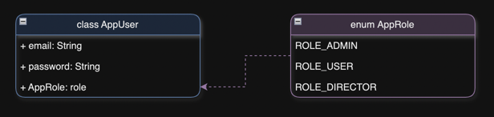

# MyAuth [Backend]

The prototype data of the server part of services of the Authorization includes the users.

**Database Diagram**

**Diagram MyAuthApplication**

**Schema of project**

**Swagger**
- if the project was launched locally - http://localhost:8080/swagger-ui/index.html
- - if project was launched in docker - http://localhost:8081/swagger-ui/index.html

**Used technology stack in my web application:**
- Java 17
- Spring Framework
- Spring Security
- JPA
- MySql
- Jupiter - Testing
- Mockito - Testing
- Gradle
- SLF4J
- Logback

### Database Structure

**Table app_user (class AppUser)**

| Column name     | Type                        | Description                             |
|-----------------|-----------------------------|-----------------------------------------|
| email           | varchar (255)               | email key of entity - NOT NULL UNIQUE   |
| password        | varchar (255)               | password for user account               |
| role            | tinyint                     | user role after registration - NOT NULL |

